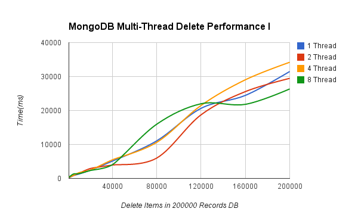
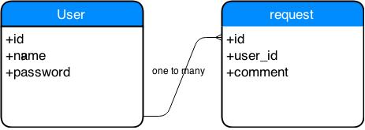

# SQLvsNOSQL
Comparison between Oracle and MongoDB

##Background
The basic concept of SQL database is Relational database. The definition of relational database is that it strictly uses relations to store data. The way that a relational database matches data is that it uses common characteristics found in the dataset. In a table of a relational database, data is divided into sets of rows and columns. One example of relational database is Microsoft SQL server. It is a set of tables containing data fitted into predefined categories. Each table contains one or more data categories in columns, and each row contains a unique instance of data for the categories defined by the columns. Without knowing the structure of the database table, users can still have access data from the database. But SQL is quite expensive and difficult to scale, because the scaling of relational database has to be distributed on to multiple servers, and handling tables across different servers is a chaos. Also, data in SQL server has to fit into tables, and it will be very complex to design database structure if data doesn’t fit into tables.

While SQL database is widely used, in the past few years, a great variety of alternative databases emerged because of the doubt of “one size fits all” thinking concerning data stores. These new database is commonly subsumed under the term of NoSQL. The basic characteristic of NoSQL is that, it would not require fixed table. Moreover, NoSQL database usually avoid join operations, and typically scale horizontally. Another important characteristic of NoSQL is that it trades off “ACID” (atomicity, consistency, isolation and durability), and it allows the schema of data differ from record to record to vary degrees. Here are some advantages of NoSQL database: 1) data can be inserted into database without defining a rigid database schema. 2) data is automatically spread onto several servers without the help of other applications. 3) NoSQL cache data in system memory to increase performance. There are three types of popular NoSQL databases: key-value stores, column-oriented database, and document-based stores.

The comparison of SQL and NoSQL database is a hot buzz in the air for a pretty long time. In the paper *A performance comparison of SQL and NoSQL databases*, Yishan Li and Sathiamoorthy Manoharan found that while NoSQL databases are generally good at storing key-value data, not all NoSQL databases perform better than SQL database. They also observed that in NoSQL database, different types of operation will lead to various performance. [quote]. In the paper *RDBMS vs NoSQL: Performance and Scaling Comparison*, Christoforos Hadjigeorgiou found that MongoDB can perform much better for complicated queries at the cost of data duplication. Another conclusion the author proposed is that MySQL performs best at deletion whereas MongoDB excels at inserting documents. [quote].

##Goals
The focus of our report is to compare the single thread and multiple threads performance, and join table performance of MySQL and MongoDB. We compare read, find, and delete operations, with different amount of data stored in database. The rest of the paper is organized as follows. In Section **Differences between SQL and NoSQL** we will introduce the major differences between the two databases. the structure of our project, and two major approaches used to test the two databases in details. 
**********In Section 4, the results of our tests will be analyzed and**********

##Differences between SQL and NoSQL
Several major differences between MySQL and MongoDB are presented as following.

###Memory Usage
While MySQL has quite reasonable memory usage mechanism, MongoDB is very good at running out of memory. When reading, the data in memory perform as cache, and when writing, memory can turn random writing operation into order writing operation, both of which lead to a high promotion of performance. However, the mechanism of MongoDB limits the control of memory usage, which would lead to a high memory occupation. When there is still enough memory, MongoDB performs satisfying reading and writing. But its performance reduces severely when memory is almost running out.

###Scalability
As we know, MySQL is a kind of relational database, which requires that the data in its server has to fit into tables, and it can be difficult to design structure if data doesn’t fit into tables. The characteristic of MySQL result in its poor scalability, so that it can be inconvenient to use MySQL when data is complex and diverse. However, as a kind of NoSQL database, MongoDB is quite flexible and has an acceptable scalability. Because MongoDB doesn’t require fixed tables, it can store variety of data as requirement of users. MySQL databases are vertically scalable, it is scaled by increasing the horsepower of the hardware, whereas the NoSQL databases are horizontally scalable, and it is scaled by increasing the databases servers in the pool of resources to reduce the load.

###Complex query performance
MongoDB could handle more complicated queries faster, mainly because of its simpler schema. However, the awesome complex query performance of MongoDB is at the cost of data duplication, which means that it may contain large amounts of data duplicates. Moreover, because of the use of subdocuments, MongoDB shows advantage over MySQL when combine complex queries with some subqueries. If complex queries are typical in an application, then MongoDB is a good choice while taking in account the cost in storage and memory.

###Single thread VS. Multiple threads
Another important aspect of difference between MySQL and MongoDB is their performance in single thread and multiple threads. When the same types of queries are performed, results of 1, 2 or more threads can be measured in scale of time. The performance is highly dependent on different queries used in tests, and might not be monotonic with numbers of threads, due to results in *RDBMS vs NoSQL: Performance and Scaling Comparison*. [quote] Also, beyond 4 threads both databases’ performance show declining and no apparent advantage of one over the other.

###Join performance

###Security
In discussing security, it is necessary to consider fully protecting the entire server host against all types of applicable attacks: eavesdropping, altering, playback, and denial of service. While MySQL performs quite safely, MongoDB still shows some doubts around security issues. By default MongoDB installs with no password credentials, which leads to an authentication weakness. There are also authorization weaknesses in MongoDB, for the reason that any created user has read-only access to the whole database. Besides, there are also admin authorization weakness, multiple interfaces weakness, and some other security issues shown in MongoDB.

###Other differences
MySQL supports for atomic transactions. The ability to contain multiple operations within a transaction and rollback the whole thing as if it were a single operation. MongoDB does not support transactions, but single operations are atomic.
MySQL uses specific language for data manipulation, e.g. Select, Insert, and Update statements, while NoSQL finish tasks through object-oriented APIs.
As for consistency, MySQL can be configured for strong consistency, while NoSQL depends on different products.

                 |     MySQL     |     MongoDB
    ------------ | ------------- | -------------
    Memory Usage |	reasonable memory usage | Need enough memory to keep efficient
    Complex query performance |	unsatisfying complex query performance | handle more complicated queries faster
    Single thread VS. Multiple thread |        |
    Join performance  |     |
    Security | give a quite safe performance | still have some security issues
    Supports transactions | supports for atomic transactions | does not support transactions but single operations are atomic
    Data manipulation | Specific language using Select, Insert, and Update | Through object-oriented APIs
    Consistency | Can be configured for strong consistency | Depends on products

##Testing System Design
In this section, MVC, Spring MVC, and Hibernate will be introduced.

###MVC FrameWork
MVC (Model–view–controller) is a software architectural pattern for implementing user interfaces. It consists of three parts: model, view, and controller.

Model – Model contains the properties and application logic, and it represents business logic and data. When the state of views and controllers changes, their associated model sends notifications, allowing views to update, and controllers to change commands.

View – View represents the presentation layer of the application, and it is used to provide UI to users. It requests information from the model and renders the model into interaction form.

Controller – Several requests are routed to individual controllers, and then it calls its related model and selects a view for displaying the results. It acts as a coordinator between the model and view.

The MVC architecture is self-explanatory. A request is sent to IIS by the browser, then IIS start to search for the route defined in MVC application. Next the requests are passed to the controller, followed by the controller communicating with the model and passing the entity to the front end. As for views, they receive model properties, and rendered these requests on the browser, passing the response to browser through IIS via controllers.

MVC is designed for a large team of developers and designers, which means that it is a quite efficient and convenient tool for development. It provides better support for test driven development, so that it is an acceptable approach for software development as almost half of the development time should be spent on testing. Also, it is effective and easy to manage a project with MVC, because it provides less complexity by dividing applications into three parts.

###Spring MVC
Spring is a popular application framework written in Java and is used by many developers to create quality applications. This framework consists of many parts which provide different services, and it helps developers to pay attention to the business logic in a proper manner. The framework of spring separates MVC in an efficient manner, and it also has the ability to provide many controllers in order to be used as the base classes.

In spring MVC framework, application will work in the following manner. First the Dispatcher – Servlet receives requests and the servlet asks the Handler – Mapping and initiate the controller, after which the controller calls the respective methods of service and returns to the Dispatcher – Servlet an object of model and view. Then the respective servlet passes the object of model to view in order to provide the result, and finally with the help of the data of model, view will provide the actual results in the form of final output to the user.

In spring MVC, developers could use any object as a command or form-backing object, that is to say, you do not need to implement a framework – specific interface or base class. Also, spring’s data binding is highly flexible: it treats type mismatches as validation errors, which can be evaluated by the application, not as system errors. For this reason, a developer does not duplicate the properties of business object as simple, untyped strings, instead of which it is often preferable to bind directly to your business objects. That is the reason why spring’s view resolution is extremely flexible.

###Hibernate
Another tool we use in our project is hibernate. Hibernate is an object – relational mapping and persistence framework for Java that allows developers to map plain old Java objects to relational database tables. Hibernate mainly aims at relieving the developer from the common data persistence related tasks. With the help of hibernate, developers can get maximum effects of data query and retrieval facilities, because hibernate maps the objects in Java with tables in database in an efficient manner. In a word, hibernate provides improved productivity, performance, maintainability, and portability.

##Testing Methods
In previous section, several differences between MySQL and MongoDB are listed. Among them we decide to choose multiple threads performance and join performance to test the two database. In this section, our test methods will be discussed in details.

###Single thread and multiple threads test
In single thread test, we use three basic queries of the two database: add, find, and delete. When adding, we insert random data into two databases. As for finding, at first we insert a certain amount of data into database, and then execute find operation to find data in the database. And when deleting, we also insert data first, then delete operation is operated to delete specific data. The performance of all the three operations are measured by time.

For the add operation, we suppose that the shorter time one database will use to finish all the adding tasks, the better the database performs. We set the amount of data as independent variable, and the time needed as dependent variable. When the number of data needed to be inserted increase, we choose the database which needs less time as the winner. 

For the find operation, the prerequisite is that there have already existed data in database. Several find operations will be performed, and the time needed will be measured. We divide the measurement into two aspects. First, we keep the number of data in database stable, and increase the number of data needed to be found. This approach could help us know which database is more suitable for heavy find load, when the number of data remains unchanged. Another method is that we keep the number of data need to be found stable, and change the number of data which has already existed in database. In this way we could find out whether the database is more suitable for finding targets in a large number of data. 

We have a similar approach for measuring the efficiency of delete operation. First we keep the number of data in database invariable, and change the number of records need to be deleted, then check the reaction time of each database. The other approach is that we keep the number of records needs to be deleted stable, and increase the number of data in database, so that we could know which database performs better when data increases.

After finishing single thread test, we now start to work on multiple threads test. We decide to test database performance in 2, 4, and 8 threads. The approaches we used to test multiple threads are the same as those used in single thread test: add, find, and delete. The difference between single thread test and multiple threads test is that, we will perform the same operations in 2, 4, and 8 threads. The test result will show if multiple threads can cause any improvement or negative effects, and if one database could perform worse or better as the number of threads increases.

### Join test

##Testing Result

####Single Thread Add Performance Comparison
<table>
<thead>
<tr class="header">
<th align="left">#Records</th>
<th align="left">1000</th>
<th align="left">5000</th>
<th align="left">10000</th>
<th align="left">20000</th>
<th align="left">40000</th>
<th align="left">80000</th>
<th align="left">140000</th>
<th align="left">160000</th>
<th align="left">200000</th>
</tr>
</thead>
<tbody>
<tr class="odd">
<td align="left">MongoDB</td>
<td align="left">1411</td>
<td align="left">2263</td>
<td align="left">2641</td>
<td align="left">2668</td>
<td align="left">5352</td>
<td align="left">8600</td>
<td align="left">13137</td>
<td align="left">17449</td>
<td align="left">21908</td>
</tr>
<tr class="even">
<td align="left">MySQL</td>
<td align="left"></td>
<td align="left"></td>
<td align="left"></td>
<td align="left"></td>
<td align="left"></td>
<td align="left"></td>
<td align="left"></td>
<td align="left"></td>
<td align="left"></td>
</tr>
</tbody>
</table>

####Single Thread Find Performance Comparison I
<table>
<thead>
<tr class="header">
<th align="left">#Records</th>
<th align="left">1000</th>
<th align="left">10000</th>
<th align="left">20000</th>
<th align="left">40000</th>
<th align="left">80000</th>
<th align="left">140000</th>
<th align="left">160000</th>
<th align="left">200000</th>
</tr>
</thead>
<tbody>
<tr class="odd">
<td align="left">MongoDB</td>
<td align="left"></td>
<td align="left"></td>
<td align="left"></td>
<td align="left"></td>
<td align="left"></td>
<td align="left"></td>
<td align="left"></td>
<td align="left"></td>
</tr>
<tr class="even">
<td align="left">MySQL</td>
<td align="left"></td>
<td align="left"></td>
<td align="left"></td>
<td align="left"></td>
<td align="left"></td>
<td align="left"></td>
<td align="left"></td>
<td align="left"></td>
</tr>
</tbody>
</table>

####Single Thread Find Performance Comparison II
<table>
<thead>
<tr class="header">
<th align="left">#Records</th>
<th align="left">1000</th>
<th align="left">10000</th>
<th align="left">20000</th>
<th align="left">40000</th>
<th align="left">80000</th>
<th align="left">140000</th>
<th align="left">160000</th>
<th align="left">200000</th>
</tr>
</thead>
<tbody>
<tr class="odd">
<td align="left">MongoDB</td>
<td align="left"></td>
<td align="left"></td>
<td align="left"></td>
<td align="left"></td>
<td align="left"></td>
<td align="left"></td>
<td align="left"></td>
<td align="left"></td>
</tr>
<tr class="even">
<td align="left">MySQL</td>
<td align="left"></td>
<td align="left"></td>
<td align="left"></td>
<td align="left"></td>
<td align="left"></td>
<td align="left"></td>
<td align="left"></td>
<td align="left"></td>
</tr>
</tbody>
</table>

####Single Thread Delete Performance Comparison I
<table>
<thead>
<tr class="header">
<th align="left">#Records</th>
<th align="left">1000</th>
<th align="left">10000</th>
<th align="left">20000</th>
<th align="left">40000</th>
<th align="left">80000</th>
<th align="left">140000</th>
<th align="left">160000</th>
<th align="left">200000</th>
</tr>
</thead>
<tbody>
<tr class="odd">
<td align="left">MongoDB</td>
<td align="left"></td>
<td align="left"></td>
<td align="left"></td>
<td align="left"></td>
<td align="left"></td>
<td align="left"></td>
<td align="left"></td>
<td align="left"></td>
</tr>
<tr class="even">
<td align="left">MySQL</td>
<td align="left"></td>
<td align="left"></td>
<td align="left"></td>
<td align="left"></td>
<td align="left"></td>
<td align="left"></td>
<td align="left"></td>
<td align="left"></td>
</tr>
</tbody>
</table>

###Multi-Thread Test

####Multi-Thread Add Performance
#####Data
<table>
<thead>
<tr class="header">
<th align="left">#Threads</th>
<th align="left">1000</th>
<th align="left">10000</th>
<th align="left">20000</th>
<th align="left">40000</th>
<th align="left">80000</th>
<th align="left">100000</th>
<th align="left">140000</th>
<th align="left">160000</th>
<th align="left">200000</th>
</tr>
</thead>
<tbody>
<tr class="odd">
<td align="left">1 Thread</td>
<td align="left">1228</td>
<td align="left">5493</td>
<td align="left">7793</td>
<td align="left">10214</td>
<td align="left">18614</td>
<td align="left">21057</td>
<td align="left">24557</td>
<td align="left">23865</td>
<td align="left">33061</td>
</tr>
<tr class="even">
<td align="left">2 Threads</td>
<td align="left">1103</td>
<td align="left">4637</td>
<td align="left">6787</td>
<td align="left">8840</td>
<td align="left">15147</td>
<td align="left">15079</td>
<td align="left">18791</td>
<td align="left">23146</td>
<td align="left">28319</td>
</tr>
<tr class="odd">
<td align="left">4 Threads</td>
<td align="left">1044</td>
<td align="left">5208</td>
<td align="left">7974</td>
<td align="left">11911</td>
<td align="left">17051</td>
<td align="left">18529</td>
<td align="left">22080</td>
<td align="left">26255</td>
<td align="left">28989</td>
</tr>
<tr class="even">
<td align="left">8 Threads</td>
<td align="left">941</td>
<td align="left">5707</td>
<td align="left">9840</td>
<td align="left">13806</td>
<td align="left">18291</td>
<td align="left">21993</td>
<td align="left">24250</td>
<td align="left">28987</td>
<td align="left">31345</td>
</tr>
</tbody>
</table>

#####Figure

#####Analysis

####Multi-Thread Find Performance

##### Find Performance Test I
######Data
<table>
<thead>
<tr class="header">
<th align="left">#Threads</th>
<th align="left">1000</th>
<th align="left">5000</th>
<th align="left">10000</th>
<th align="left">20000</th>
<th align="left">40000</th>
<th align="left">80000</th>
<th align="left">120000</th>
<th align="left">160000</th>
<th align="left">200000</th>
</tr>
</thead>
<tbody>
<tr class="odd">
<td align="left">1 Thread</td>
<td align="left">669</td>
<td align="left">2556</td>
<td align="left">4336</td>
<td align="left">7670</td>
<td align="left">10210</td>
<td align="left">19119</td>
<td align="left">23878</td>
<td align="left">33536</td>
<td align="left">40495</td>
</tr>
<tr class="even">
<td align="left">2 Threads</td>
<td align="left">478</td>
<td align="left">2159</td>
<td align="left">3598</td>
<td align="left">6058</td>
<td align="left">7392</td>
<td align="left">13443</td>
<td align="left">16516</td>
<td align="left">22291</td>
<td align="left">24557</td>
</tr>
<tr class="odd">
<td align="left">4 Threads</td>
<td align="left">379</td>
<td align="left">1666</td>
<td align="left">3104</td>
<td align="left">5193</td>
<td align="left">8803</td>
<td align="left">12079</td>
<td align="left">19512</td>
<td align="left">20013</td>
<td align="left">26154</td>
</tr>
<tr class="even">
<td align="left">8 Threads</td>
<td align="left">314</td>
<td align="left">1408</td>
<td align="left">2514</td>
<td align="left">5019</td>
<td align="left">7465</td>
<td align="left">13822</td>
<td align="left">17659</td>
<td align="left">19349</td>
<td align="left">25642</td>
</tr>
</tbody>
</table>

######Figure
######Analysis

##### Find Performance Test II
######Data
<table>
<thead>
<tr class="header">
<th align="left">#Threads</th>
<th align="left">10000</th>
<th align="left">20000</th>
<th align="left">40000</th>
<th align="left">80000</th>
<th align="left">160000</th>
<th align="left">200000</th>
</tr>
</thead>
<tbody>
<tr class="odd">
<td align="left">1 Thread</td>
<td align="left">3024</td>
<td align="left">4126</td>
<td align="left">2715</td>
<td align="left">2820</td>
<td align="left">3626</td>
<td align="left">3282</td>
</tr>
<tr class="even">
<td align="left">2 Threads</td>
<td align="left">2494</td>
<td align="left">2700</td>
<td align="left">2434</td>
<td align="left">2472</td>
<td align="left">3456</td>
<td align="left">2876</td>
</tr>
<tr class="odd">
<td align="left">4 Threads</td>
<td align="left">1875</td>
<td align="left">2032</td>
<td align="left">1890</td>
<td align="left">2302</td>
<td align="left">2646</td>
<td align="left">2023</td>
</tr>
<tr class="even">
<td align="left">8 Threads</td>
<td align="left">1647</td>
<td align="left">1433</td>
<td align="left">1524</td>
<td align="left">1480</td>
<td align="left">1525</td>
<td align="left">1653</td>
</tr>
</tbody>
</table>
######Figure
######Analysis

####Multi-Thread Delete Performance

##### Delete Performance Test I
######Data
<table>
<thead>
<tr class="header">
<th align="left">#Threads</th>
<th align="left">1000</th>
<th align="left">5000</th>
<th align="left">10000</th>
<th align="left">20000</th>
<th align="left">40000</th>
<th align="left">80000</th>
<th align="left">120000</th>
<th align="left">160000</th>
<th align="left">200000</th>
</tr>
</thead>
<tbody>
<tr class="odd">
<td align="left">1 Thread</td>
<td align="left">202</td>
<td align="left">819</td>
<td align="left">1286</td>
<td align="left">2380</td>
<td align="left">5075</td>
<td align="left">11026</td>
<td align="left">20619</td>
<td align="left">24445</td>
<td align="left">31485</td>
</tr>
<tr class="even">
<td align="left">2 Threads</td>
<td align="left">231</td>
<td align="left">816</td>
<td align="left">1460</td>
<td align="left">2840</td>
<td align="left">3673</td>
<td align="left">5913</td>
<td align="left">18427</td>
<td align="left">24890</td>
<td align="left">29295</td>
</tr>
<tr class="odd">
<td align="left">4 Threads</td>
<td align="left">277</td>
<td align="left">783</td>
<td align="left">1511</td>
<td align="left">2220</td>
<td align="left">5261</td>
<td align="left">9938</td>
<td align="left">20535</td>
<td align="left">28330</td>
<td align="left">32314</td>
</tr>
<tr class="even">
<td align="left">8 Threads</td>
<td align="left">215</td>
<td align="left">998</td>
<td align="left">1251</td>
<td align="left">2079</td>
<td align="left">3778</td>
<td align="left">15499</td>
<td align="left">21391</td>
<td align="left">21308</td>
<td align="left">25748</td>
</tr>
</tbody>
</table>

######Figure

######Analysis

##### Delete Performance Test II
######Data
<table>
<thead>
<tr class="header">
<th align="left">#Threads</th>
<th align="left">10000</th>
<th align="left">20000</th>
<th align="left">40000</th>
<th align="left">80000</th>
<th align="left">120000</th>
<th align="left">160000</th>
<th align="left">200000</th>
</tr>
</thead>
<tbody>
<tr class="odd">
<td align="left">1 Thread</td>
<td align="left">1418</td>
<td align="left">1890</td>
<td align="left">1481</td>
<td align="left">1411</td>
<td align="left">1986</td>
<td align="left">1026</td>
<td align="left">936</td>
</tr>
<tr class="even">
<td align="left">2 Threads</td>
<td align="left">1186</td>
<td align="left">1362</td>
<td align="left">976</td>
<td align="left">1662</td>
<td align="left">1533</td>
<td align="left">882</td>
<td align="left">1005</td>
</tr>
<tr class="odd">
<td align="left">4 Threads</td>
<td align="left">1274</td>
<td align="left">1189</td>
<td align="left">858</td>
<td align="left">1250</td>
<td align="left">1238</td>
<td align="left">799</td>
<td align="left">904</td>
</tr>
<tr class="even">
<td align="left">8 Threads</td>
<td align="left">1043</td>
<td align="left">1100</td>
<td align="left">813</td>
<td align="left">1042</td>
<td align="left">891</td>
<td align="left">971</td>
<td align="left">993</td>
</tr>
</tbody>
</table>
######Figure

######Analysis

###Relation Mapping
- Relational design in MySQL
<table border=0 style="border-collapse:collapse;">
  <thead>
 　<th>one to many</th><th>many to many</th>
  </thead>
 <tr>
  <td></td>
  <td></td>
 </tr>
</table>
- Embedded collections in MongoDB

##### Search in mulitple tables in MySQL
<table border=0 style="border-collapse:collapse;">
  <thead>
 　<th>#Records</th><th>many to many</th>
  </thead>
 <tr>
  <td>user's request 
   user+request</td>
  <td></td>
 </tr>
 <tr>
  <td>house's request 
   reqeust+house_request+house</td>
  <td></td>
 </tr>
</table>
##### Search in nested collections in MongoDB
##Discussion

##Conclusion

##Future Work

##References

