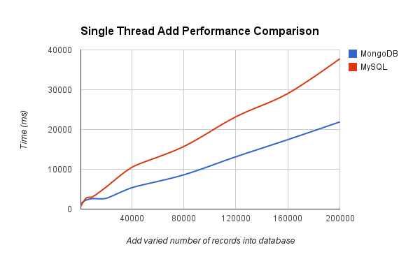
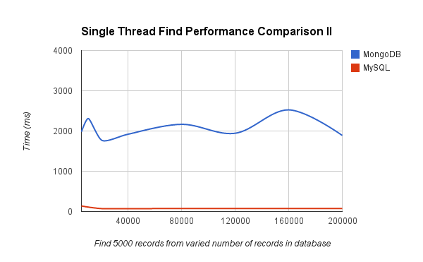
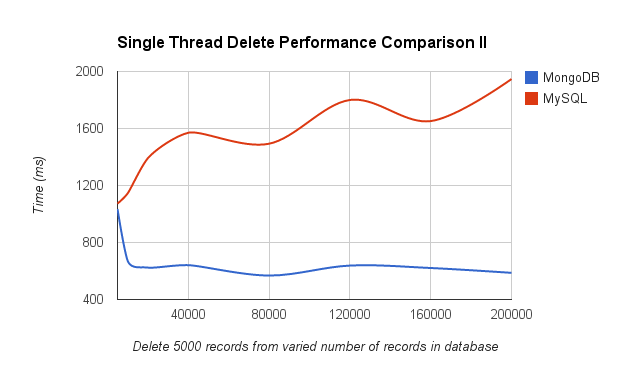
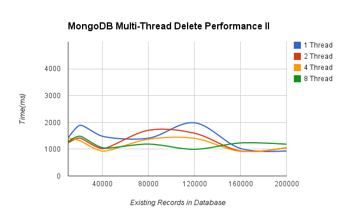

# SQLvsNOSQL
Comparison between MySQL and MongoDB

##Background
The basic concept of SQL database is Relational database. The definition of relational database is that it strictly uses relations to store data. The way that a relational database matches data is that it uses common characteristics found in the dataset. In a table of a relational database, data is divided into sets of rows and columns. One example of relational database is Microsoft SQL server. It is a set of tables containing data fitted into predefined categories. Each table contains one or more data categories in columns, and each row contains a unique instance of data for the categories defined by the columns. Without knowing the structure of the database table, users can still have access data from the database. But SQL is quite expensive and difficult to scale, because the scaling of relational database has to be distributed on to multiple servers, and handling tables across different servers is a chaos [1]. Also, data in SQL server has to fit into tables, and it will be very complex to design database structure if data doesn’t fit into tables.

While SQL database is widely used, in the past few years, a great variety of alternative databases emerged because of the doubt of “one size fits all” thinking concerning data stores. These new database is commonly subsumed under the term of NoSQL. The basic characteristic of NoSQL is that, it would not require fixed table. Moreover, NoSQL database usually avoid join operations, and typically scale horizontally. Another important characteristic of NoSQL is that it trades off “ACID” (atomicity, consistency, isolation and durability), and it allows the schema of data differ from record to record to vary degrees[2]. Here are some advantages of NoSQL database: 1) data can be inserted into database without defining a rigid database schema. 2) data is automatically spread onto several servers without the help of other applications. 3) NoSQL cache data in system memory to increase performance. There are three types of popular NoSQL databases: key-value stores, column-oriented database, and document-based stores.

The comparison of SQL and NoSQL database is a hot buzz in the air for a pretty long time. In the paper *A performance comparison of SQL and NoSQL databases*, Yishan Li and Sathiamoorthy Manoharan found that while NoSQL databases are generally good at storing key-value data, not all NoSQL databases perform better than SQL database. They also observed that in NoSQL database, different types of operation will lead to various performance [3]. In the paper *RDBMS vs NoSQL: Performance and Scaling Comparison*, Christoforos Hadjigeorgiou found that MongoDB can perform much better for complicated queries at the cost of data duplication. Another conclusion the author proposed is that MySQL performs best at deletion whereas MongoDB excels at inserting documents [4].

##Goals
The focus of our report is to compare the single thread and multiple threads performance, and join table performance of MySQL and MongoDB. We compare read, find, and delete operations, with different amount of data stored in database. The rest of the paper is organized as follows. In Section **Differences between SQL and NoSQL** we will introduce the major differences between the two databases. In Section **Testing System Design** the structure of our project will be introduced, and in Section **Test methods** two major approaches used to test the two databases in details. At last, our test result will be discussed and analyzed.

##Differences between SQL and NoSQL
Several major differences between MySQL and MongoDB are presented as following.

###Memory Usage
While MySQL has quite reasonable memory usage mechanism, MongoDB is very good at running out of memory. When reading, the data in memory perform as cache, and when writing, memory can turn random writing operation into order writing operation, both of which lead to a high promotion of performance. However, the mechanism of MongoDB limits the control of memory usage, which would lead to a high memory occupation. When there is still enough memory, MongoDB performs satisfying reading and writing. But its performance reduces severely when memory is almost running out.

###Scalability
As we know, MySQL is a kind of relational database, which requires that the data in its server has to fit into tables, and it can be difficult to design structure if data doesn’t fit into tables. The characteristic of MySQL result in its poor scalability, so that it can be inconvenient to use MySQL when data is complex and diverse. However, as a kind of NoSQL database, MongoDB is quite flexible and has an acceptable scalability. Because MongoDB doesn’t require fixed tables, it can store variety of data as requirement of users [3]. MySQL databases are vertically scalable, it is scaled by increasing the horsepower of the hardware, whereas the NoSQL databases are horizontally scalable, and it is scaled by increasing the databases servers in the pool of resources to reduce the load.

###Complex query performance
MongoDB could handle more complicated queries faster, mainly because of its simpler schema. However, the awesome complex query performance of MongoDB is at the cost of data duplication, which means that it may contain large amounts of data duplicates. Moreover, because of the use of subdocuments, MongoDB shows advantage over MySQL when combine complex queries with some subqueries. If complex queries are typical in an application, then MongoDB is a good choice while taking in account the cost in storage and memory.

###Single thread VS. Multiple threads
Another important aspect of difference between MySQL and MongoDB is their performance in single thread and multiple threads. When the same types of queries are performed, results of 1, 2 or more threads can be measured in scale of time. The performance is highly dependent on different queries used in tests, and might not be monotonic with numbers of threads, due to results in *RDBMS vs NoSQL: Performance and Scaling Comparison*.  Also, beyond 4 threads both databases’ performance show declining and no apparent advantage of one over the other[4].

###Data Association
In a SQL database, when creating a database, common sense dictates that we use separate tables for different types of entities. Some examples are: customers, orders, items, messages etc... But we also need to have relationships between these tables. For instance, customers make orders, and orders contain items. These relationships need to be represented in the database. Also, when fetching data with SQL, we need to use certain types of JOIN queries to get what we need. In the MongoDB,  a data model uses embedded documents to describe relationships between connected data. Decisions that affect how you model data can affect application performance and database capacity.

###Security
In discussing security, it is necessary to consider fully protecting the entire server host against all types of applicable attacks: eavesdropping, altering, playback, and denial of service. While MySQL performs quite safely, MongoDB still shows some doubts around security issues. By default MongoDB installs with no password credentials, which leads to an authentication weakness. There are also authorization weaknesses in MongoDB, for the reason that any created user has read-only access to the whole database. Besides, there are also admin authorization weakness, multiple interfaces weakness, and some other security issues shown in MongoDB.

###Other differences
MySQL supports for atomic transactions. The ability to contain multiple operations within a transaction and rollback the whole thing as if it were a single operation. MongoDB does not support transactions, but single operations are atomic.
MySQL uses specific language for data manipulation, e.g. Select, Insert, and Update statements, while NoSQL finish tasks through object-oriented APIs[5].
As for consistency, MySQL can be configured for strong consistency, while NoSQL depends on different products[6].

                 |     MySQL     |     MongoDB
    ------------ | ------------- | -------------
    Memory Usage |	reasonable memory usage | Need enough memory to keep efficient
    Complex query performance |	unsatisfying complex query performance | handle more complicated queries faster
    Single thread VS. Multiple thread |   vary with different operations    |   no apparent advantage over 4 threads
    Data association  |  support dynamic SQL query like join tables   |  support embedded collections
    Security | give a quite safe performance | still have some security issues
    Supports transactions | supports for atomic transactions | does not support transactions but single operations are atomic
    Data manipulation | Specific language using Select, Insert, and Update | Through object-oriented APIs
    Consistency | Can be configured for strong consistency | Depends on products

##Testing System Design
We designed the DAO layer for two databases MySQL and MongoDB. Based on DAO layer, the test environment is set up using spring test and Junit. In this section, Spring, Spring Data Mongo and Hibernate will be introduced.

###Spring 
Spring is a popular application framework written in Java and is used by many developers to create quality applications. This framework consists of many parts which provide different services, and it helps developers to pay attention to the business logic in a proper manner[8]. The technology that Spring is most identified with is the Dependency Injection (DI) flavor of Inversion of Control. Dependency Injection (or sometime called wiring) helps in gluing different classes together and same time keeping them independent. Testing an application written with Spring is simple because environment-dependent code is moved into this framework. Furthermore, by using JavaBean-style POJOs, it becomes easier to use dependency injection for injecting test data[9].

###Spring Data MongoDB
The Spring Data MongoDB project provides integration with the MongoDB document database. Key functional areas of Spring Data MongoDB are a POJO centric model for interacting with a MongoDB DBCollection and easily writing a Repository style data access layer.

The class MongoTemplate is the central class of the Spring’s MongoDB support providing a rich feature set to interact with the database. The template offers convenience operations to create, update, delete and query for MongoDB documents and provides a mapping between your domain objects and MongoDB documents.

###Hibernate
Another tool we use in our project is hibernate. Hibernate is an object – relational mapping and persistence framework for Java that allows developers to map plain old Java objects to relational database tables. Hibernate mainly aims at relieving the developer from the common data persistence related tasks[10]. With the help of hibernate, developers can get maximum effects of data query and retrieval facilities, because hibernate maps the objects in Java with tables in database in an efficient manner. In a word, hibernate provides improved productivity, performance, maintainability, and portability[11].

A Session in Hibernate is used to get a physical connection with a database. The Session object is lightweight and designed to be instantiated each time an interaction is needed with the database. Persistent objects are saved and retrieved through a Session object.The session objects should not be kept open for a long time because they are not usually thread safe and they should be created and destroyed them as needed. 

##Testing Methods
In previous section, several differences between MySQL and MongoDB are listed. Among them we decide to choose multiple threads performance and join performance to test the two database. In this section, our test methods will be discussed in details.

###Single thread and multiple threads test
In single thread test, we use three basic queries of the two database: add, find, and delete. When adding, we insert random data into two databases. As for finding, at first we insert a certain amount of data into database, and then execute find operation to find data in the database. And when deleting, we also insert data first, then delete operation is operated to delete specific data. The performance of all the three operations are measured by time.

For the add operation, we suppose that the shorter time one database will use to finish all the adding tasks, the better the database performs. We set the amount of data as independent variable, and the time needed as dependent variable. When the number of data needed to be inserted increase, we choose the database which needs less time as the winner. 

For the find operation, the prerequisite is that there have already existed data in database. Several find operations will be performed, and the time needed will be measured. We divide the measurement into two aspects. First, we keep the number of data in database stable, and increase the number of data needed to be found. This approach could help us know which database is more suitable for heavy find load, when the number of data remains unchanged. Another method is that we keep the number of data need to be found stable, and change the number of data which has already existed in database. In this way we could find out whether the database is more suitable for finding targets in a large number of data. 

We have a similar approach for measuring the efficiency of delete operation. First we keep the number of data in database invariable, and change the number of records need to be deleted, then check the reaction time of each database. The other approach is that we keep the number of records needs to be deleted stable, and increase the number of data in database, so that we could know which database performs better when data increases.

After finishing single thread test, we now start to work on multiple threads test. We decide to test database performance in 2, 4, and 8 threads. The approaches we used to test multiple threads are the same as those used in single thread test: add, find, and delete. The difference between single thread test and multiple threads test is that, we will perform the same operations in 2, 4, and 8 threads. The test result will show if multiple threads can cause any improvement or negative effects, and if one database could perform worse or better as the number of threads increases.

##Testing Result

In order to compare single thread performance of SQL and NoSQL databases, we choose MySQL(SQL) and MongoDB(NoSQL) to test insertion, findbyId and deletion performance by comparing their time cost. We have used different numbers of records and strategies to compare the performance between SQL and NoSQL.

####Single Thread insertion Performance Comparison

To test the insertion performance of MySQL and MongoDB, we had used a method of adding different size of records into database and compared their time cost. The number of records  changes from 1000 to 200000, and we divided them into 9 groups and test their executing time by adding the same number of records into two databases at each time. 

######Data
<table>
<thead>
<tr class="header">
<th align="left">#Records</th>
<th align="left">1000</th>
<th align="left">5000</th>
<th align="left">10000</th>
<th align="left">20000</th>
<th align="left">40000</th>
<th align="left">80000</th>
<th align="left">140000</th>
<th align="left">160000</th>
<th align="left">200000</th>
</tr>
</thead>
<tbody>
<tr class="odd">
<td align="left">MongoDB</td>
<td align="left">1411</td>
<td align="left">2263</td>
<td align="left">2641</td>
<td align="left">2668</td>
<td align="left">5352</td>
<td align="left">8600</td>
<td align="left">13137</td>
<td align="left">17449</td>
<td align="left">21908</td>
</tr>
<tr class="even">
<td align="left">MySQL</td>
<td align="left">703</td>
<td align="left">2742</td>
<td align="left">3089</td>
<td align="left">5425</td>
<td align="left">10452</td>
<td align="left">15705</td>
<td align="left">23175</td>
<td align="left">29037</td>
<td align="left">37783</td>
</tr>
</tbody>
</table>

We have tested 9 groups of records,  and the number of records is from 1000 to 200000 (See Table). The data in the first row stands for different size of records, and the data in the second and third rows are time cost of adding different number of records into MongoDB and MySQL.

######Figure

######Analysis

According to above diagram, we can see MongoDB's line is under MySQL's line. It means MongoDB is faster than MySQL in insertion the same size of records into databases. Based on above test results, we conclude that MongoDB's adding performance is better than MySQL's adding performance.

####Single Thread Find Performance Comparison I

We have adopted two methods to test the find performance of MySQL and MongoDB. One method is to test the time cost in finding varied number of records from databases, in this case, the the number of records in the databases are fixed (200000). The other method is to test the time cost in finding fixed records (5000) from databases, the number of records in databases increases from 5000 to 200000. 

######Data
<table>
<thead>
<tr class="header">
<th align="left">#Records</th>
<th align="left">1000</th>
<th align="left">5000</th>
<th align="left">10000</th>
<th align="left">20000</th>
<th align="left">40000</th>
<th align="left">80000</th>
<th align="left">140000</th>
<th align="left">160000</th>
<th align="left">200000</th>
</tr>         
</thead>
<tbody>
<tr class="odd">
<td align="left">MongoDB</td>
<td align="left">1369</td>
<td align="left">1049</td>
<td align="left">2827</td>
<td align="left">3647</td>
<td align="left">5775</td>
<td align="left">10865</td>
<td align="left">15659</td>
<td align="left">18071</td>
<td align="left">28114</td>   
</tr>
<tr class="even">
<td align="left">MySQL</td>
<td align="left">15</td>
<td align="left">74</td>
<td align="left">136</td>
<td align="left">247</td>
<td align="left">320</td>
<td align="left">413</td>
<td align="left">449</td>
<td align="left">505</td>
<td align="left">561</td>
</tr>
</tbody>
</table>

We have tested 9 groups of data,  and the numbers of records change from 1000 to 200000 (See Table). The data in the first row stands for different records' size, the second and third rows are time cost for two databases. Each column between the second and third rows stands for time cost of finding the same number of records from MongoDB and MySQL.

######Figure

######Analysis

According to above diagram, the line of MongoDB is over the line of MySQL. It means that MySQL is faster than MongoDB in finding varied number of records in databases which have fixed number of records.  We also see that the line of MySQL grows very slow in finding the increasing number of records from fixed number of records in database. We can get that the the size of records in database has little affection on MySQL's finding performance.

####Single Thread Find Performance Comparison II

######Data
<table>
<thead>
<tr class="header">
<th align="left">#Records</th>
<td align="left">5000</td>
<td align="left">10000</td>
<td align="left">20000</td>
<td align="left">40000</td>
<td align="left">80000</td>
<td align="left">120000</td>
<td align="left">160000</td>
<td align="left">200000</td>
</tr>
</thead>    
<tbody>
<tr class="odd">
<td align="left">MongoDB</td>
<td align="left">1979</td>
<td align="left">2310</td>
<td align="left">1774</td>
<td align="left">1921</td>
<td align="left">2166</td>
<td align="left">1944</td>
<td align="left">2525</td>
<td align="left">1889</td>
</tr>
<tr class="even">
<td align="left">MySQL</td>
<td align="left">138</td>
<td align="left">110</td>
<td align="left">72</td>
<td align="left">69</td>
<td align="left">76</td>
<td align="left">74</td>
<td align="left">74</td>
<td align="left">75</td>
</tr>
</tbody>
</table>

We have tested 8 groups of data. The data in the first row stands for different records' size, the second and third rows are time cost for two databases. Each column between the second and third rows stands for time cost of finding 5000 records from databases with increasing number of records from 5000 to 200000.

######Figure

######Analysis

According to above diagram, the line of MongoDB is over the line of MySQL. It means that MySQL is faster than MongoDB in finding 5000 records from databases with increasing number of records.  We also see that the line of MySQL is smooth and level when they find a fixed number of records from increasing number of records in database, which means the size of records in database has limited affection on MySQL's findbyID performance.

####Single Thread Delete Performance Comparison I

In order to test the delete performance of MySQL and MongoDB, we have adopted two strategies to test their time cost. One way is to randomly delete fixed number of records from varied data size in databases, the other way is to randomly delete varied number of records from fixed records from databases. 

######Data
<table>
<thead>
<tr class="header">
<th align="left">#Records</th>
<th align="left">1000</th>
<th align="left">5000</th>
<th align="left">10000</th>
<th align="left">20000</th>
<th align="left">40000</th>
<th align="left">80000</th>
<th align="left">140000</th>
<th align="left">160000</th>
<th align="left">200000</th>
</tr>     
</thead>
<tbody>
<tr class="odd">
<td align="left">MongoDB</td>
<td align="left">192</td>
<td align="left">697</td>
<td align="left">1167</td>
<td align="left">1688</td>
<td align="left">3221</td>
<td align="left">4535</td>
<td align="left">6310</td>
<td align="left">9147</td>
<td align="left">12319</td>     
</tr>
<tr class="even">
<td align="left">MySQL</td>
<td align="left">847</td>
<td align="left">1947</td>
<td align="left">2449</td>
<td align="left">4478</td>
<td align="left">8054</td>
<td align="left">11940</td>
<td align="left">15842</td>
<td align="left">19022</td>
<td align="left">21822</td>   
</tr>
</tbody>
</table>

We have tested 9 groups of data. The data in the first row stands for different records' size of finding from databases, and each column between the second and third rows stands for time cost when finding the same number of records from MongoDB and MySQL.

######Figure

######Analysis

According to the above diagram, the line of MongoDB is under the line of MySQL. It means that MongoDB is faster than MySQL in deletion varied  number of records from databases which have fixed number of records(200000). 
          
####Single Thread Delete Performance Comparison II

######Data
<table>
<thead>
<tr class="header">
<th align="left">#Records</th>
<th align="left">5000</th>
<th align="left">10000</th>
<th align="left">20000</th>
<th align="left">40000</th>
<th align="left">80000</th>
<th align="left">140000</th>
<th align="left">160000</th>
<th align="left">200000</th>
</tr>     
</thead>
<tbody>
<tr class="odd">
<td align="left">MongoDB</td>
<td align="left">1035</td>
<td align="left">673</td>
<td align="left">624</td>
<td align="left">641</td>
<td align="left">568</td>
<td align="left">638</td>
<td align="left">621</td>
<td align="left">587</td>     
</tr>
<tr class="even">
<td align="left">MySQL</td>
<td align="left">1073</td>
<td align="left">1144</td>
<td align="left">1391</td>
<td align="left">1570</td>
<td align="left">1493</td>
<td align="left">1800</td>
<td align="left">1652</td>
<td align="left">1947</td>    
</tr>
</tbody>
</table>
          
We have tested 8 groups of data. The data in the first row stands for different records size from 5000 to 20000 in the databases, and each column between the second and third rows stands for the time cost in finding 5000 records from databases with varied size of records.

######Figure

######Analysis

According to above diagram, the blue line of MongoDB is under the the red line of MySQL. It means MongoDB has a better performance than MySQL in deletion fixed number of records (5000) from databases with varied number of records.

###More in NoSQL DB (Multi-Thread Test)

In order to test the multi-thread performance of NoSQL databases, we have picked the Mongo Database and tested its insert, findbyId, delete performance by comparing its time cost in different threads. We have used single thread, dual threads, four threads and eight threads to execute query so that we could see whether using <b>multiple threads</b> is an effective way to <b>save time</b> in Mongo like NOSQL databases.

####Multi-Thread Add Performance

To test the insert performance, we have utilized the control variates method by using different number of threads to add the same number of records to the database. And after that we increase the records inserted to the database and check the time for inserting to see if there is any difference using different number of threads.

#####Data

<table>
<thead>
<tr class="header">
<th align="left">#Threads/Data Inserted</th>
<th align="left">1000</th>
<th align="left">10000</th>
<th align="left">20000</th>
<th align="left">40000</th>
<th align="left">80000</th>
<th align="left">100000</th>
<th align="left">140000</th>
<th align="left">160000</th>
<th align="left">200000</th>
</tr>
</thead>
<tbody>
<tr class="odd">
<td align="left">1 Thread</td>
<td align="left">1228</td>
<td align="left">5493</td>
<td align="left">7793</td>
<td align="left">10214</td>
<td align="left">18614</td>
<td align="left">21057</td>
<td align="left">24557</td>
<td align="left">23865</td>
<td align="left">33061</td>
</tr>
<tr class="even">
<td align="left">2 Threads</td>
<td align="left">1175</td>
<td align="left">4707</td>
<td align="left">6859</td>
<td align="left">8906</td>
<td align="left">15489</td>
<td align="left">15341</td>
<td align="left">18995</td>
<td align="left">23215</td>
<td align="left">28381</td>
</tr>
<tr class="odd">
<td align="left">4 Threads</td>
<td align="left">1188</td>
<td align="left">5346</td>
<td align="left">8120</td>
<td align="left">12122</td>
<td align="left">17250</td>
<td align="left">18727</td>
<td align="left">22316</td>
<td align="left">26486</td>
<td align="left">29256</td>
</tr>
<tr class="even">
<td align="left">8 Threads</td>
<td align="left">1138</td>
<td align="left">6076</td>
<td align="left">10204</td>
<td align="left">13968</td>
<td align="left">18527</td>
<td align="left">22397</td>
<td align="left">24609</td>
<td align="left">29854</td>
<td align="left">32018</td>
</tr>
</tbody>
</table>

We have tested 9 groups of data, each column of the first row means the number of data that have been inserted into the database, from 1000 to 200000. And the corresponding column on the second to the fifth row is the number of time in millisecond that is spent on this insertion. For two or more threads, the time given is the last-finished time the threads take to perform the insertion. 

For example, if the insert 1000 records of data using 4 threads, each of the threads will only insert 250 items of data, each taking 1020 ms, 1100 ms, 869 ms, 1188 ms. Therefore, the total amount of time showed on the table would the max of the four time which is 1188 ms. The insertion can not be defined as finished until the last thread finishes its job.

#####Figure

#####Analysis

From the figure, we can easily see that the number of threads doesn't have much improvement on the time used to do the insertion. The time line travels across each other at times and increase linearly with the upsuring inserted records. 

The reason why multi-thread has no effect on the insertion performance is probably because of the lock system of the database. When one thread has entered the critical section, other thread has to wait until the ongoing thread finish. In that case, the multiple threads just divide the task separetely and use almost the same amount of time as the single thread does.  Therefore, for insertion, there is no point to use multi-thread to visit the database as multiple threads may consume more resources than single thread.

####Multi-Thread Find Performance

To test the find performance, we have implemented two test methods. Both of the methods have utilized the control variates method. One is to find certain number of records in the database while the number of records in the database is increasing. The other is to find an increasing number of records in a database with fixed number of records. Both of the methods compare the result with single thread and multi-thread. The time is counted to see if multi-thread execution has any benefit on the time factor.

##### Find Performance Test I

In Find Performance test I, the task is to find an increasing number of records in the database with 200000 records. The time of the query is calculated and compared with the result using two or more threads. 

######Data

<table>
<thead>
<tr class="header">
<th align="left">#Threads</th>
<th align="left">1000</th>
<th align="left">5000</th>
<th align="left">10000</th>
<th align="left">20000</th>
<th align="left">40000</th>
<th align="left">80000</th>
<th align="left">120000</th>
<th align="left">160000</th>
<th align="left">200000</th>
</tr>
</thead>
<tbody>
<tr class="odd">
<td align="left">1 Thread</td>
<td align="left">669</td>
<td align="left">2556</td>
<td align="left">4336</td>
<td align="left">7670</td>
<td align="left">10210</td>
<td align="left">19119</td>
<td align="left">23878</td>
<td align="left">33536</td>
<td align="left">40495</td>
</tr>
<tr class="even">
<td align="left">2 Threads</td>
<td align="left">531</td>
<td align="left">2205</td>
<td align="left">3672</td>
<td align="left">6132</td>
<td align="left">7463</td>
<td align="left">13545</td>
<td align="left">16597</td>
<td align="left">22391</td>
<td align="left">24650</td>
</tr>
<tr class="odd">
<td align="left">4 Threads</td>
<td align="left">592</td>
<td align="left">1863</td>
<td align="left">3291</td>
<td align="left">5376</td>
<td align="left">8999</td>
<td align="left">12298</td>
<td align="left">19754</td>
<td align="left">20307</td>
<td align="left">26495</td>
</tr>
<tr class="even">
<td align="left">8 Threads</td>
<td align="left">360</td>
<td align="left">1479</td>
<td align="left">2647</td>
<td align="left">5427</td>
<td align="left">7908</td>
<td align="left">13954</td>
<td align="left">18270</td>
<td align="left">19893</td>
<td align="left">26214</td>
</tr>
</tbody>
</table>

We have tested 9 groups of data, each column of the first row means the number of data that needs to be acquired through the query process, from 1000 to 200000. And the corresponding column on the second to the fifth row is the number of time in millisecond that is spent on this query. For two or more threads, the time given is the last-finished time of the threads take to perform the query. 

######Figure

######Analysis

As you can see from the above figure, the time spend on the single thread is larger than multi-thread ones. It almost takes 50% more time than the multi-thread ones, which is 40000 ms compared to 25000 ms. From this prospective, we can infer that using multi-thread will improve the time factor on the query like execution on the Mongo like NoSQL database. However, we could also see that the time spent on query by two or more threads are almost the same, which means the performance gained through adding threads is limited. If you have already got two threads performing the query on the NoSQL databases, adding more threads won't bring you significant improvement as you may expect. 

##### Find Performance Test II

In Find Performance test II, the task is to find 5000 records in the database while the number of records in the database is increasing, from 10000 to 200000. The time of the query is calculated and compared with the result using two or more threads. 

######Data

<table>
<thead>
<tr class="header">
<th align="left">#Threads</th>
<th align="left">10000</th>
<th align="left">20000</th>
<th align="left">40000</th>
<th align="left">80000</th>
<th align="left">160000</th>
<th align="left">200000</th>
</tr>
</thead>
<tbody>
<tr class="odd">
<td align="left">1 Thread</td>
<td align="left">3024</td>
<td align="left">4126</td>
<td align="left">2715</td>
<td align="left">2820</td>
<td align="left">3626</td>
<td align="left">3282</td>
</tr>
<tr class="even">
<td align="left">2 Threads</td>
<td align="left">2577</td>
<td align="left">2792</td>
<td align="left">2538</td>
<td align="left">2567</td>
<td align="left">3544</td>
<td align="left">3053</td>
</tr>
<tr class="odd">
<td align="left">4 Threads</td>
<td align="left">2054</td>
<td align="left">2285</td>
<td align="left">2080</td>
<td align="left">2527</td>
<td align="left">2849</td>
<td align="left">2116</td>
</tr>
<tr class="even">
<td align="left">8 Threads</td>
<td align="left">1788</td>
<td align="left">1630</td>
<td align="left">1889</td>
<td align="left">1755</td>
<td align="left">1916</td>
<td align="left">2265</td>
</tr>
</tbody>
</table>

We have tested 7 groups of data, each column of the first row means the number of records existing in the database, from 10000 to 200000. And the corresponding column on the second to the fifth row is the number of time in millisecond that is spent on finding 5000 records in this database. For two or more threads, the time given is the last-finished time of the threads take to perform the query. 

######Figure

######Analysis

We can infer from the above figure that the time spent on searching won't increase a lot as the amount of records existing in the database increases. The time is around 2000 ms to 4000 ms. Multiple threads do have some impact on the time cost of the query process, but it is not worthwhile. The most significant gap between single and multiple threads is 2000 ms which is 2 seconds. It won't be an issue for using another 2 seconds to find 5000 data in a database in worst-case scenario. However, if the number of records needs to found increases, maybe multi-thread way would be a more acceptable methods.

####Multi-Thread Delete Performance

To test the delete multi-thread performance of NoSQL database, we have implemented two test methods. Both of the methods have utilized the control variates method. One is to delete certain number of records in the database while the number of records in the database is increasing. The other is to delete an increasing number of records in a database with fixed number of records. Both of the methods compare the result with single thread and multi-thread. The time is counted to see if multi-thread execution has any benefit on the time factor.

##### Delete Performance Test I

In Delete Performance test I, the task is to delete an increasing number of records in a database with 200000 records. The time of the deletion is calculated and compared with the result using two or more threads. 

######Data

<table>
<thead>
<tr class="header">
<th align="left">#Threads</th>
<th align="left">1000</th>
<th align="left">5000</th>
<th align="left">10000</th>
<th align="left">20000</th>
<th align="left">40000</th>
<th align="left">80000</th>
<th align="left">120000</th>
<th align="left">160000</th>
<th align="left">200000</th>
</tr>
</thead>
<tbody>
<tr class="odd">
<td align="left">1 Thread</td>
<td align="left">202</td>
<td align="left">819</td>
<td align="left">1286</td>
<td align="left">2380</td>
<td align="left">5075</td>
<td align="left">11026</td>
<td align="left">20619</td>
<td align="left">24445</td>
<td align="left">31485</td>
</tr>
<tr class="even">
<td align="left">2 Threads</td>
<td align="left">270</td>
<td align="left">855</td>
<td align="left">1507</td>
<td align="left">2879</td>
<td align="left">3934</td>
<td align="left">5965</td>
<td align="left">18703</td>
<td align="left">25558</td>
<td align="left">29463</td>
</tr>
<tr class="odd">
<td align="left">4 Threads</td>
<td align="left">398</td>
<td align="left">862</td>
<td align="left">1679</td>
<td align="left">2398</td>
<td align="left">5443</td>
<td align="left">10588</td>
<td align="left">21461</td>
<td align="left">29038</td>
<td align="left">34204</td>
</tr>
<tr class="even">
<td align="left">8 Threads</td>
<td align="left">319</td>
<td align="left">1290</td>
<td align="left">1402</td>
<td align="left">2304</td>
<td align="left">4006</td>
<td align="left">15926</td>
<td align="left">21977</td>
<td align="left">21817</td>
<td align="left">26349</td>
</tr>
</tbody>
</table>

We have tested 9 groups of data, each column of the first row means the number of data that needs to be deleted through the deletion process, from 1000 to 200000. And the corresponding column on the second to the fifth row is the number of time in millisecond that is spent on this query. For two or more threads, the time given is the last-finished time of the threads take to perform the deletion. 

######Figure

######Analysis

As we can infer from the figure, the time spent on the deletion increases with the number of delete operation increase, as we expected. The multiple threads don't help to shorten the time spend on the deletion. This is probably the same reason as in the insertion, the lock in the database prohibit multiple threads entering the critical section of the deletion process. Therefore, only one thread would be able to perform normally and others are set to wait until it finishes.

##### Delete Performance Test II

In Delete Performance test II, the task is to delete an 5000 records in the database while the number of records in the database is increasing, from 10000 to 200000. The time of the deletion is calculated and compared with the result using two or more threads. 

######Data

<table>
<thead>
<tr class="header">
<th align="left">#Threads</th>
<th align="left">10000</th>
<th align="left">20000</th>
<th align="left">40000</th>
<th align="left">80000</th>
<th align="left">120000</th>
<th align="left">160000</th>
<th align="left">200000</th>
</tr>
</thead>
<tbody>
<tr class="odd">
<td align="left">1 Thread</td>
<td align="left">1418</td>
<td align="left">1890</td>
<td align="left">1481</td>
<td align="left">1411</td>
<td align="left">1986</td>
<td align="left">1026</td>
<td align="left">936</td>
</tr>
<tr class="even">
<td align="left">2 Threads</td>
<td align="left">1238</td>
<td align="left">1415</td>
<td align="left">1024</td>
<td align="left">1706</td>
<td align="left">1595</td>
<td align="left">934</td>
<td align="left">1055</td>
</tr>
<tr class="odd">
<td align="left">4 Threads</td>
<td align="left">1412</td>
<td align="left">1319</td>
<td align="left">930</td>
<td align="left">1371</td>
<td align="left">1404</td>
<td align="left">919</td>
<td align="left">1053</td>
</tr>
<tr class="even">
<td align="left">8 Threads</td>
<td align="left">1280</td>
<td align="left">1487</td>
<td align="left">1053</td>
<td align="left">1190</td>
<td align="left">996</td>
<td align="left">1233</td>
<td align="left">1186</td>

</tr>
</tbody>
</table>

We have tested 7 groups of data, each column of the first row means the number of records existing in the database, from 10000 to 200000. And the corresponding column on the second to the fifth row is the number of time in millisecond that is spent on deleting 5000 records in this database. For two or more threads, the time given is the last-finished time of the threads take to perform the query. 

######Figure

######Analysis

As we can infer from the above figure, the time in performing this task is fairly small, only takes about 1000 ms to 2000 ms. And we cannot see any performance gain by using multi-thread methods. I think the reason is the same as mentioned in the former test methods that the lock in the database prohibits the multiple threads from enterring into its critical section.

###Data Association

###Relation Mapping
- Relational design in MySQL
<table border=0 style="border-collapse:collapse;">
  <thead>
 　<th>one to many</th><th>many to many</th>
  </thead>
 <tr>
  <td></td>
  <td></td>
 </tr>
</table>
- Embedded document in MongoDB
 In MongoDB,  we would apply following model structure to represent one to many relation.
<pre><code>
{
	"_id":
	"name":
	"password":
	"requestList":{
		{ 
		   "_id":
		   "comment":
		   "house":{
		   	  "_id":
		   	  "name":
		   	  "type":
		   }
		},
		{ 
		   "_id":
		   "comment":
		   "house":{
		   	  "_id":
		   	  "name":
		   	  "type":
		   }
		}
	}
}

</code></pre>
##### Search in mulitple tables in MySQL
In MySQL, we must define separate tables to represent different models and each column should be the smallest unit.
To associate the relationship between tables,  foreign key or join table are applied under the schema. In this scenario, 
searching in MySQL involves several tables using complicated query like join. 
###### Data
<table border=0 style="border-collapse:collapse;">
  <thead>
 　<th>#Records 
 (request*100)</th>
 　<th>100</th>
 　<th>1000</th>
 <th>10000</th>
  </thead>
 <tr>
  <td>user+request</td>
  <td>73</td>
  <td>597</td>
  <td>4937</td>
 </tr>
 <tr>
  <td>reqeust+house_request+house</td>
  <td>456</td>
  <td>7473</td>
  <td>88244</td>
 </tr>
</table>

The records is the size of "house" and "user" table, each house and user record associated with 100 requests. To search a user's request list, using the sql "select * from request where user_id=?". To map the relation between request and house, MySQL supports join table and the sql would be like this "select * from request inner join house_request on request.id=house_request.request_id inner join house on house.id=house_request.house_id where house.id=?" 				                                   				                                				                                     
###### Analysis
As we can see, searching requests responding to house takes 10+ times than searching user's requests. Notice that when records of user and house is 10000, the request table size is 100*10000. Querying user's requests only search in the "request" table while  house's requests would take 2 join operations which consumes large time. The result of join even generates larger size of result set. Query in that result set pretends to be extremely slow. Generally, query across multiple tables using sql operations would take much time than single table. The situation get worse when these table scaling up. 
##### Search in embedded document in MongoDB
In MongoDB, each collection is stored as document. Each coloumn inside a collection also could be a collection. So we could use nested collections to store the relationship inside the document.
A huge advantage over SQL when searching in MongoDB is only inside one document without joining.
###### Data
<table border=0 style="border-collapse:collapse;">
  <thead>
 　<th>#Records</th>
 　<th>100</th>
 　<th>1000</th>
 　<th>10000</th>
 　<th>100000</th>
  </thead>
 <tr>
  <td>user</td>
  <td>82</td>
  <td>56</td>
  <td>95</td>
  <td>103</td>
 </tr>
 <tr>
  <td>user.requestList</td>
  <td>42</td>
  <td>102</td>
  <td>1407</td>
  <td>22778</td>
 </tr>
 <tr>
  <td>user.requestList.house</td>
  <td>45</td>
  <td>112</td>
  <td>1891</td>
  <td>72789</td>
 </tr>
</table>

In MongoDB, each user record contains a size of 100 requestList collection. We search on 3 level in user collection. First we search a specific user on name using query "{'name':?}". Then we compared with query in embedded collection using embedded query "{'requestList.comment':?}". Further query on embedded collection inside requestList.house  by using query "{'requestList.house.name':?}".
###### Analysis
There is no extra effort to find user's requests when we find a specific user and varies a little when scaling up. Any search takes in single collection. But with embedded query, searching would happen in each embedded collections inside the document. 
 
Using the embedded collection, it is hard to find a set of requests responding to a specific house. We can insert such a embedded request collection inside the house collection which causes duplicate records on request. In this schema, the document with embedded collections also takes more space in disk and may causes split because the maximum document size in mongoDB is 16MB. To avoid this, We would expect a small size of embedded collection.

##Discussion

- We have spotted that the Multi-thread bottle-neck in the Find test of MongoDB. However, we don't think it should be as NoSQL database definitely prevails SQL database when it deals with the massive distributed thing, eg. big data, big numbers of users, big numbers of computers, big supply chains, big science, and so on. Therefore, we are thinking if our dataset are too small compared to the BIG thing, which is the reason why adding more threads are not giving more performance improvement. It should have an overwhelming improvement when its scale get expanded by using more infrastructure such as a cluster of NoSQL server.

##Conclusion
####Multi-threaded Performance

- As we can see from the above Section, implementing multiple threads in insertion and deletion in Mongo like NoSQL database on a single instance has little improvement on time factors. However, this method have signficant influence on query performance, even on a single instance, the performance could be improved by at least 50%. More improvement could be achieved by utilizing expanded scale of cluster servers. 

#### Data Association
Association in MySQL always require extra column or table to store key of related table. It is low efficient when query happens across multiple tables using complicated SQL. We have to avoid unnecessary join with different large size tables. MongoDB achieved this by using embedded collection. The association data is stored inside the document and much faster to locate without query for other documents. It may sacrifice extra space to achieve high efficiency in query.
 
In a scenario that requires much relational design, it is needed in MySQL to strictly define the structure of tables. With dynamic SQL query, we could easily associated data and map the relation. And MongoDB is hard to express the relations between different collections without SQL. But in a less related and huge scale scenario, query is expected inside single table which SQL lost its power. MongoDB is more suit using embedded structure and flexible to future extension in data model. 

According to single-thread performance test, we can see that MongoDB has a better performance in Insertion and deletion, and the number of records in databases affects the deletion performance of MySQL, but has little affection on the deletion performance of MongoDB. MySQL has a better performance in findbyID, and the number of records in databases can't clearly affect the findbyID performance of MySQL and MongoDB.

##Future Work

For the restriction of time and equipment, some work will be included in our future tasks.
* More powerful hardware will be implemented, so that more large data can be used in tests, as a result of which more precise conclusion can be reached. 
* Besides the JUnit Test, the front-end test will be included in our research, for the reason that it could bring more results on Multi-thread test of SQL database. 
* The performance of other supported NoSQL database such as Cassandra will be involved.
* Hardware Extension: MySQL consumes large volume of hardware resource, it is expected a improvement in performance with hardware improvement. MongoDB also support distributed deployment which database run in multiple nodes. The performance is expected different with single node.   

##References
[1]Differences between SQL and NoSQL <addr>http://www.thewindowsclub.com/difference-sql-nosql-comparision

[2]SQL VS. NoSQL <addr>http://www.thegeekstuff.com/2014/01/sql-vs-nosql-db/

[3] Ramon Lawrence, “Integration and Virtualization of Relational SQL and NoSQL Systems including MySQL and MongoDB”, in *International Conference on Computational Science and Computational Intelligence, 2014*.

[4] Christoforos Hadjigeorgiou, “RDBMS vs NoSQL: Performance and Scaling Comparison”, in *MSc in High Performance Computing, 2013*.

[5] Alexandru Boicea, Florin Radulescu, and Laura Ioana Agapin, “MongoDB vs Oracle - database comparison”, in *2012 Third International Conference on Emerging Intelligent Data and Web Technologies*.

[6] Yishan Li, Sathiamoorthy Manoharan, “A performance comparison of SQL and NoSQL databases”, in *IEEE 2013*.

[7]Spring framework reference: <addr>http://docs.spring.io/spring/docs/current/spring-framework-reference/html/mvc.html

[8]Spring Framework <addr>http://www.tutorialspoint.com/spring/spring_web_mvc_framework.htm

[9]Introduction to Spring MVC <addr>http://crunchify.com/spring-mvc-introduction-to-spring-3-mvc-framework/

[10]Introduction to Hibernate <addr>http://www.java2blog.com/2013/01/introduction-to-hibernate-framework.html

[11]Hibernate Tutorial <addr>https://docs.jboss.org/hibernate/orm/3.2/reference/en/html/tutorial.html
